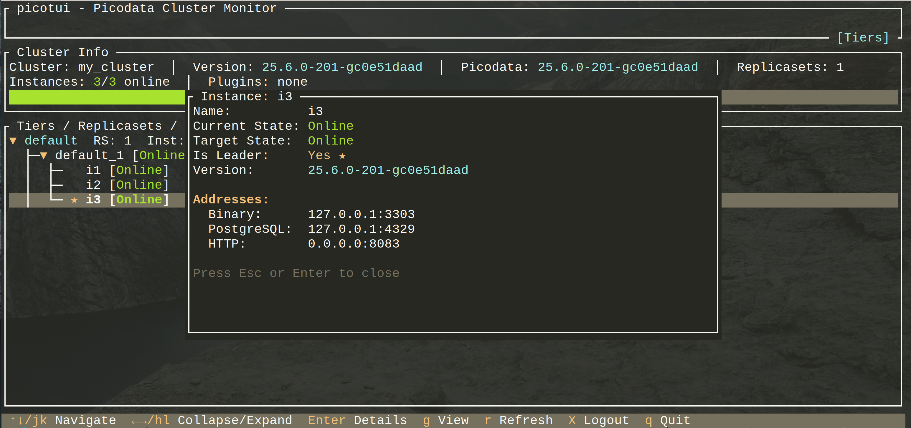

# picotui

[](README.md)
[](README.ru.md)

[](https://github.com/vkrivopalov/picotui/releases)
[](https://github.com/vkrivopalov/picotui/actions/workflows/ci.yml)
[](https://opensource.org/licenses/BSL-1.0)

Терминальный интерфейс для управления кластером [Picodata](https://picodata.io/), построенный на базе [ratatui](https://ratatui.rs/).

## Версионирование

Picotui следует [SemVer](https://semver.org/). Каждый релиз указывает версию Picodata, с которой он совместим.

Текущая версия **0.1.0** совместима с **Picodata 25.5**.

## Возможности

- **Обзор кластера**: Просмотр имени кластера, версии, использования памяти и количества инстансов
- **Несколько режимов отображения**: Переключение между режимами Tiers (дерево), Replicasets (список) и Instances (список)
- **Иерархическое дерево**: Навигация по уровням tiers → replicasets → instances со сворачиванием/разворачиванием
- **Сортировка**: Сортировка инстансов по имени или failure domain, по возрастанию или убыванию
- **Фильтрация**: Фильтрация инстансов по имени, tier, replicaset, адресу или failure domain
- **Детали инстанса**: Просмотр подробной информации, включая адреса, failure domains и состояние
- **JWT-аутентификация**: Поддержка входа при включённой аутентификации
- **Сохранение сессий**: Опция «Запомнить меня» для сохранения входа между сессиями
- **Автообновление**: Автоматическое обновление данных с настраиваемым интервалом
- **Режим отладки**: Логирование всех API-запросов/ответов для диагностики

## Установка

### Из исходного кода

```bash
git clone https://github.com/vkrivopalov/picotui.git
cd picotui
cargo build --release
```

Бинарный файл будет расположен в `target/release/picotui`.

### Требования

- Rust 1.70+ (для сборки из исходного кода)
- Работающий кластер [Picodata](https://picodata.io/) с включённым HTTP API

## Использование

```bash
# Подключение к локальному инстансу Picodata
picotui --url http://localhost:8080

# Подключение с настраиваемым интервалом обновления (в секундах)
picotui --url http://localhost:8080 --refresh 10

# Отключить автообновление
picotui --url http://localhost:8080 --refresh 0

# Включить отладочное логирование (записывается в picotui.log)
picotui --url http://localhost:8080 --debug
```

### Параметры командной строки

| Параметр | Описание | По умолчанию |
|----------|----------|--------------|
| `-u`, `--url` | URL HTTP API Picodata | `http://localhost:8080` |
| `-r`, `--refresh` | Интервал автообновления в секундах (0 — отключить) | `5` |
| `-d`, `--debug` | Включить отладочное логирование в `picotui.log` | выкл. |
| `-h`, `--help` | Показать справку | |
| `-V`, `--version` | Показать версию | |

## Горячие клавиши

### Навигация
| Клавиша | Действие |
|---------|----------|
| `↑` / `k` | Переместить выделение вверх |
| `↓` / `j` | Переместить выделение вниз |
| `→` / `l` | Развернуть выбранный элемент (режим Tiers) |
| `←` / `h` | Свернуть выбранный элемент (режим Tiers) |
| `Enter` | Показать детали инстанса |

### Режимы отображения
| Клавиша | Действие |
|---------|----------|
| `g` | Переключить режим (Tiers → Replicasets → Instances) |
| `1` | Переключиться на режим Tiers (иерархическое дерево) |
| `2` | Переключиться на режим Replicasets (плоский список) |
| `3` | Переключиться на режим Instances (список с сортировкой/фильтрацией) |

### Сортировка (только в режиме Instances)
| Клавиша | Действие |
|---------|----------|
| `s` | Переключить поле сортировки (Name → Failure Domain) |
| `S` | Переключить порядок сортировки (по возрастанию ↑ / по убыванию ↓) |

### Фильтрация (только в режиме Instances)
| Клавиша | Действие |
|---------|----------|
| `/` | Начать режим фильтрации |
| *ввод* | Текст фильтра (в режиме фильтрации) |
| `Enter` | Применить фильтр и выйти из режима фильтрации |
| `Esc` | Очистить фильтр и выйти из режима фильтрации |
| `Backspace` | Удалить последний символ (в режиме фильтрации) |

### Действия
| Клавиша | Действие |
|---------|----------|
| `r` | Обновить данные |
| `X` | Выйти из учётной записи и закрыть (удаляет сохранённую сессию) |
| `q` | Выход |
| `Ctrl+C` | Выход |
| `Esc` | Закрыть всплывающее окно / Очистить фильтр |

### Экран входа
| Клавиша | Действие |
|---------|----------|
| `Tab` / `↑` / `↓` | Переход между полями |
| `Space` | Переключить флажок (Запомнить меня) |
| `Ctrl+S` | Показать/скрыть пароль |
| `Enter` | Отправить форму входа |
| `Esc` / `q` | Выход |

## Скриншоты



### Режим Tiers (иерархическое дерево)
```
┌─ picotui - Picodata Cluster Monitor ────────────────────────[Tiers]─┐
├─────────────────────────────────────────────────────────────────────┤
│ Cluster: my-cluster │ Version: 25.6.0 │ Picodata: 25.6.0           │
│ Instances: 6/6 online │ Plugins: none                              │
│ Memory: 1.2 GiB / 4.0 GiB (30.0%) ████████░░░░░░░░░░░░░░░░░░░░░░░  │
├─────────────────────────────────────────────────────────────────────┤
│ ▼ default  RS: 2  Inst: 6  RF: 3  Buckets: 3000  Vote: ✓           │
│   ├─▼ r1 [Online]  Inst: 3  Mem: 600 MiB/2 GiB (30.0%)             │
│   │  ├─ ★ i1 [Online]  10.0.0.1:3301  pg:10.0.0.1:5432             │
│   │  ├─   i2 [Online]  10.0.0.2:3301  pg:10.0.0.2:5432             │
│   │  └─   i3 [Offline] 10.0.0.3:3301  pg:10.0.0.3:5432             │
│   └─▶ r2 [Online]  Inst: 3  Mem: 600 MiB/2 GiB (30.0%)             │
│ ▶ storage  RS: 1  Inst: 3  RF: 3  Buckets: 0  Vote: ✗              │
├─────────────────────────────────────────────────────────────────────┤
│ ↑↓/jk Navigate  ←→/hl Collapse/Expand  Enter Details  g View  ...  │
└─────────────────────────────────────────────────────────────────────┘
```

### Режим Instances (плоский список с сортировкой/фильтрацией)
```
┌─ picotui - Picodata Cluster Monitor ─────────────────────[Instances]┐
├─────────────────────────────────────────────────────────────────────┤
│ Cluster: my-cluster │ ...                                          │
├─ Instances  Filter: "dc1" ──────────────────────── Sort: Name ↑ ───┤
│ ★ i1 [Online]  RS: r1  10.0.0.1:3301  datacenter:dc1               │
│   i2 [Online]  RS: r1  10.0.0.2:3301  datacenter:dc1               │
│   i4 [Online]  RS: r2  10.0.0.4:3301  datacenter:dc1               │
├─────────────────────────────────────────────────────────────────────┤
│ ↑↓/jk Navigate  Enter Details  g View  s Sort  S Order  / Filter   │
└─────────────────────────────────────────────────────────────────────┘
```

## Режимы отображения

Picotui предлагает три различных способа просмотра данных кластера, аналогично веб-интерфейсу [Picodata](https://picodata.io/):

### Режим Tiers (по умолчанию)

Иерархическое дерево, показывающее полную структуру кластера:
- Tiers на верхнем уровне (разворачиваемые)
- Replicasets вложены в tiers (разворачиваемые)
- Instances вложены в replicasets

Используйте `→`/`l` для разворачивания и `←`/`h` для сворачивания узлов. Дерево показывает использование памяти, количество инстансов, фактор репликации и количество бакетов на каждом уровне.

### Режим Replicasets

Плоский список всех replicasets из всех tiers. Каждая строка показывает:
- Имя replicaset и состояние (Online/Offline/Expelled)
- Имя родительского tier
- Количество инстансов
- Использование памяти и процент заполнения

### Режим Instances

Плоский список всех инстансов с возможностью сортировки и фильтрации:
- Имя инстанса с индикатором лидера (★)
- Текущее состояние
- Родительский replicaset
- Бинарный адрес
- Failure domain (если задан)

## Сортировка

Сортировка доступна только в **режиме Instances**.

| Поле сортировки | Описание |
|-----------------|----------|
| **Name** | Сортировка по имени инстанса в алфавитном порядке |
| **Failure Domain** | Сортировка по значениям failure domain, затем по имени |

Нажмите `s` для переключения поля сортировки. Нажмите `S` (Shift+s) для переключения между порядком по возрастанию (↑) и по убыванию (↓).

Текущая настройка сортировки отображается в правом нижнем углу панели инстансов.

## Фильтрация

Фильтрация доступна только в **режиме Instances**.

Нажмите `/` для входа в режим фильтрации. Введите текст фильтра для сужения списка отображаемых инстансов. Фильтр ищет совпадения в:

- **Имя инстанса** (например, `i3` найдёт инстанс «i3»)
- **Имя tier** (например, `storage` найдёт все инстансы в tier «storage»)
- **Имя replicaset** (например, `r1` найдёт все инстансы в replicaset «r1»)
- **Бинарный адрес** (например, `10.0.0.1` найдёт инстансы с этим IP)
- **Значения failure domain** (например, `dc1` найдёт инстансы в датацентре «dc1»)

Поиск регистронезависимый и ищет подстроки в любом месте поля.

Нажмите `Enter` для применения фильтра и продолжения навигации. Нажмите `Esc` для очистки фильтра. Активный фильтр отображается в заголовке.

## Используемые API-эндпоинты

TUI подключается к следующим эндпоинтам HTTP API [Picodata](https://picodata.io/):

- `GET /api/v1/config` — Проверка, включена ли аутентификация
- `POST /api/v1/session` — Вход с именем пользователя и паролем
- `GET /api/v1/session` — Обновление токенов сессии
- `GET /api/v1/cluster` — Получение обзора кластера
- `GET /api/v1/tiers` — Получение tiers с replicasets и instances

## Сохранение сессий

Когда флажок «Запомнить меня» установлен при входе (включён по умолчанию), токен сессии сохраняется локально:

| Платформа | Расположение токена |
|-----------|---------------------|
| Linux/FreeBSD | `~/.config/picotui/tokens.json` |
| macOS | `~/Library/Application Support/picotui/tokens.json` |
| Windows | `%APPDATA%\picotui\tokens.json` |

При следующем запуске picotui автоматически использует сохранённый токен, пропуская экран входа.

Для очистки сохранённых сессий нажмите `X` (Shift+x) для выхода из учётной записи и закрытия приложения. Это удалит сохранённый токен.

## Режим отладки

При запуске с `--debug` все API-запросы и ответы записываются в `picotui.log`:

```bash
picotui --url http://localhost:8081 --debug

# В другом терминале
tail -f picotui.log
```

## Участие в разработке

Мы приветствуем вклад в проект! Не стесняйтесь создавать issues и pull requests.

## Лицензия

[BSL-1.0](LICENSE) (Boost Software License 1.0)
